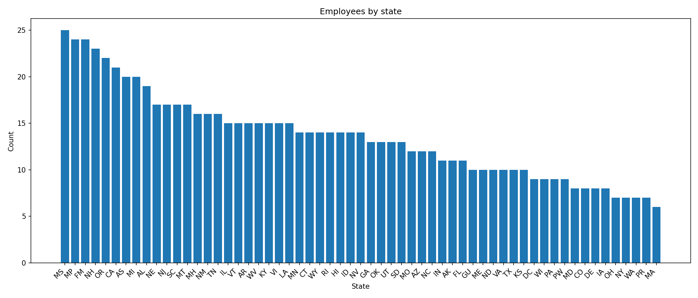

# Week_10_Assigment

This homework implements a complete **Airflow pipeline** that ingests, transforms, merges, loads, and analyzes two related synthetic datasets.  

## 📊 Workflow Steps
**DAG name:** `Homework_week10`  
**Database:** PostgreSQL (Dockerized)

| Stage | Description |
|--------|-------------|
| **1. Initialize Workspace** | Creates the local folders used by the pipeline. |
| **2. Data Ingestion (Parallel)** | Generates two synthetic CSVs using the `faker` library:<br>• `people.csv` – includes person information and state.<br>• `companies.csv` – includes company details. |
| **3. Transformation (Parallel)** | Cleans and standardizes both datasets (lowercasing, combining names, removing blanks). |
| **4. Merge** | Combines the two datasets into a single CSV (`employees_final.csv`) using `company_id` as a key. |
| **5. Load to PostgreSQL** | Creates schema `week8_demo` and loads data into the `employees` table. |
| **6. Analysis** | Reads from PostgreSQL and produces:<br>• `summary_by_state.csv` – row counts by U.S. state.<br>• `summary_by_state.png` – a visualization of employees by state. |
| **7. Cleanup** | Deletes temporary files from `/opt/airflow/data/tmp_etl/`. |

---

### ⚙️ Parallelism and TaskGroups

- The **people** and **companies** ingestion and transformation tasks run **in parallel**.  
- Related ingestion/transformation tasks are grouped using a **TaskGroup (`ingest_transform`)**.  
- XComs are used **only to pass file paths**, never the raw data.

---
### Successful DAG execution in the Airflow UI


### The DAG graph view


## Outputs

All outputs are stored in the shared Airflow `data/` volume.

| File | Description |
|-------|-------------|
| `data/employees_final.csv` | Final merged dataset loaded into PostgreSQL |
| `data/summary_by_state.csv` | Aggregated record counts by state |
| `data/summary_by_state.png` | Visualization generated by Matplotlib |

**Output graph:**



The figure above shows the number of generated employees per U.S. state. Data are randomly generated, so distributions vary between runs.

---

## 🧰 Development Setup

### Requirements
- Docker and Docker Compose  
- Airflow image
- PostgreSQL + Redis (already configured in `docker-compose.yml`)  
- `matplotlib` and `faker` installed in the Airflow image
  
**Note: I used the deployment for the Demo Class.**

### Run Instructions
```bash
# Build and start Airflow environment
docker compose up -d --build

# Access Airflow UI
http://localhost:8080
# (Username: airflow / Password: airflow)

```
